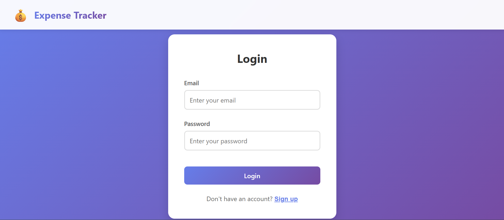
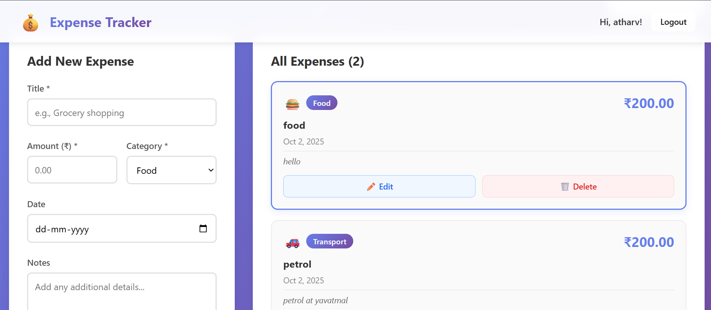

# 💰 Expense Tracker

A simple and user-friendly expense tracking application built with the **MERN stack** (MongoDB, Express, React, Node.js). 
It helps you keep track of your daily expenses, manage categories, and view your spending history.

---

## 🚀 Features

* Add, edit, and delete expenses
* Categorize expenses (food, travel, shopping, etc.)
* View all transactions in one place
* Simple and clean UI
* Secure user authentication (login/signup)

---

## 🛠️ Tech Stack

* **Frontend**: React.js
* **Backend**: Node.js + Express
* **Database**: MongoDB

---

## ⚡ How to Run Locally

1. Clone the repository:

   ```bash
   git clone https://github.com/<your-username>/Expense-Tracker.git
   cd Expense-Tracker
   ```

2. Install dependencies for both frontend & backend:

   ```bash
   cd backend
   npm install
   cd ../frontend
   npm install
   ```

3. Start the backend server:

   ```bash
   cd backend
   npm start
   ```

4. Start the frontend:

   ```bash
   cd frontend
   npm start
   ```

---

## 📸 Screenshot





---

## ✨ Future Improvements

* Add expense analytics (charts & graphs)
* Export expenses to Excel/PDF
* Dark mode support

---

👉 This README is clean and shows only what’s important for recruiters/interviewers.

Do you want me to also make a **backend README (API documentation)** or just keep this single README for the whole project?
